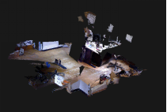

# idog_ORB_SLAM : a ORB_SLAM based Robot Control solution

## Features

A real time 2D Occupied grid map and 3D Point cloud generator based on ORB_SLAM2. You can subscribe the output of this project into ROS
Navigation STACK or other robot control system, to tuning your own robot under pure camera sensor!

Output grid and point clouds:




## Dependence

C++11

OpenCv3

Pangolin

Eigen3

ROS: kinetic or Indigo

## Install

This repo is base on [ raulmur/ORB_SLAM2 ](https://github.com/raulmur/ORB_SLAM2), vocabulary of ORB_SLAM2 DBoW2 was not contained, download the vocabulary file from [here](https://github.com/raulmur/ORB_SLAM2/tree/master/Vocabulary), and put it into ./Vocabulary under root dir of the project.

```bash
    git clone https://github.com/Jackey-Huo/idog_ORB_SLA://github.com/Jackey-Huo/idog_ORB_SLAM.git
    cd idog_ORB_SLAM
    mkdir Vocabulary & cd Vocabulary
    wget https://raw.githubusercontent.com/raulmur/ORB_SLAM2/master/Vocabulary/ORBvoc.txt.tar.gz
```

### Build the project

Then build it. This repo is built under cmake and g++ tool chain, you can also compile it under other compiler, but I provide a script to build all the target in one command :)

```bash
    chmod +x build.sh
    ./build.sh
```

### Build it under ROS support

Make sure you have installed ros in your system properly, or you may need to vision [ros.org](https://ros.org) to install and configure your system environment.

```bash
    export ROS_PACKAGE_PATH=${ROS_PACKAGE_PATH}:Your/PATH/idog_ORB_SLAM/Examples/ROS
    chmod +x build_ros.sh
    ./build_ros.sh
```

## Getting Start

### Run it under ROS using your own camera

first, you need to open your own camera, e.g. if you use primesense, then

```bash
    roslaunch openni_launch openni_launch.launch
```

Then, start our system by typing at the root dir of the project

```bash
    export ROS_PACKAGE_PATH=${ROS_PACKAGE_PATH}:Your/PATH/idog_ORB_SLAM/Examples/ROS
    rosrun idog_ORB_SLAM2 RGBD Vocabulary/ORBvoc.bin YourCamSetting.yaml
```

Now, you can subscribe or view the output under topic /map and /pointcloud

### Run a demo using TUM Dataset

Download a TUM rgb-d dataset from [here](http://vision.in.tum.de/data/datasets/rgbd-dataset/download), then associate it under the instruction properly.

Then, start TUM Dataset demo by typing under Download a TUM rgb-d dataset from [here](http://vision.in.tum.de/data/datasets/rgbd-dataset/download), then associate it under the instruction properly.

Then, start TUM Dataset demo by typing under root dir

```bash
    ./bin/rgbd_tum Vocabulary/ORBvoc.bin Examples/RGB-D/TUMX.yaml path/to/dataset/dir path/to/associate/file
```

